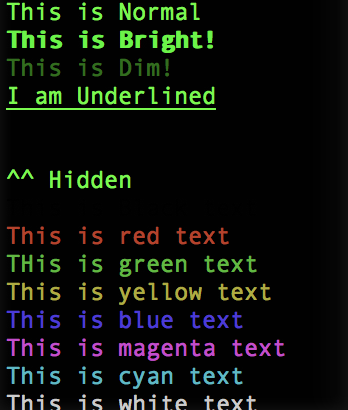

# Colored-Logs
Makes colored logs easier than other node modules.

# Nostalgia Repo
This was one of the first code projects I ever made. Around 2016-2017. It's only here for the memories

To use Add the file into your workspace and require it 

```
const log                   =                      require('./colorText');
```




# Commands

### The color of these depend on the color of your terminal text
```
log.log()

log.bright()

log.dim()

log.underLine()

log.blink()

log.reverse()

log.hidden()
```


### These will change the color of the text
```
log.black()

log.red()

log.green()

log.yellow()

log.blue()

log.magenta()

log.cyan()

log.white()
````


